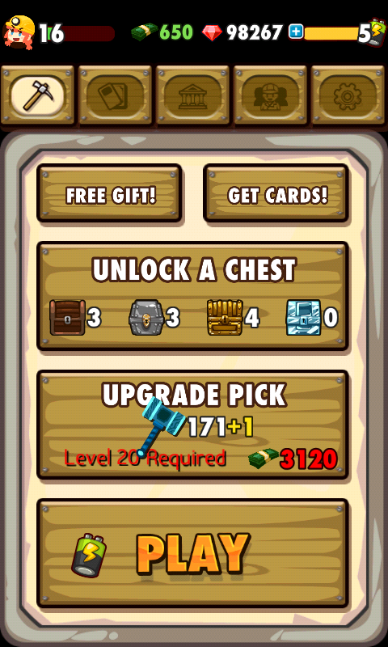

# PocketMine Hacking

This document details how I modified PocketMine, a very popular Unity-based Android game, to get me a TON of _gems_ (see the 98267 in the screenshot below), an in-game currency which can normally only be obtained via in-game purchase.

**This is for proof-of-concept only and was carried out only for educational purpose. There are no binaries and none will be available. Please don't use this to steal things.**

Let's start!

## Finding the save file

I found the save file in /data/data/ca.roofdog.pocketmine/shared\_prefs/ca.roofdog.pocketmine.xml
You might need to actually root your phone to access this.
Its horrendously slow to open in vim, but Firefox surprising does the job and also cleans up the "&quots\;" everywhere in the file.

We're mostly interested in the data under the key "\_data". This is your player data. You can see your gem count is literally just written right in here.

Can we simply just change it? Nope! Doing so causes the game to invalidate your save and reset all your data. But how did it know that we modified the save?

## Tracing Unity

The next step was to modify the file and watch _adb logcat_ for any debug activity. It turns out that you do indeed find some:

	[Unity]: Invalid save game hash, resetting data.

So the next step is to do a search for this string in the entire apk after dumping the apk with _apktool_. We find that "Assembly-CSharp.dll" in the Managed/ folder gives a hit. Too bad it's a binary.

All the code and scripts for the game itself are in this assembly, so we copy all the dlls in Managed/ over to a new directory and install Mono.

We can then:

* Create an empty project, attach Assembly-CSharp as a project reference, and then double click on it to see the code in a nice READABLE format
* Copy all the Managed/ dlls to a folder and dump Assembly-CSharp with _monodis_, then do a text search for "Invalid save"

We see some interesting stuff in the disassembly:

    IL_0000:  ldstr "_data"
    IL_0005:  ldsfld string [mscorlib]System.String::Empty
    IL_000a:  call string class [UnityEngine]UnityEngine.PlayerPrefs::GetString(string, string)
    IL_000f:  stloc.0 
    IL_0010:  ldstr "_hash"
    IL_0015:  ldsfld string [mscorlib]System.String::Empty
    IL_001a:  call string class [UnityEngine]UnityEngine.PlayerPrefs::GetString(string, string)
    IL_001f:  stloc.1 
    IL_0020:  ldloc.1 
    IL_0021:  ldloc.0 
    IL_0022:  call string class Security::ComputeHash(string)
    IL_0027:  call bool string::op_Equality(string, string)
    IL_002c:  brfalse IL_0042
                                                                                                                                                                                 
    IL_0031:  ldarg.0 
    IL_0032:  ldloc.0 
    IL_0033:  call class [mscorlib]System.Collections.Hashtable class ['Assembly-CSharp-firstpass']MiniJsonExtensions::hashtableFromJson(string)
    IL_0038:  stfld class [mscorlib]System.Collections.Hashtable Preference::_data
    IL_003d:  br IL_008d

    IL_0042:  ldloc.0 
    IL_0043:  ldsfld string [mscorlib]System.String::Empty
    IL_0048:  call bool string::op_Equality(string, string)
    IL_004d:  brfalse IL_0062

    IL_0052:  ldarg.0 
    IL_0053:  newobj instance void class [mscorlib]System.Collections.Hashtable::'.ctor'()
    IL_0058:  stfld class [mscorlib]System.Collections.Hashtable Preference::_data
    IL_005d:  br IL_008d

    IL_0062:  ldstr "Invalid save game hash, resetting data."
    IL_0067:  ldstr "Error"

From this, we can deduce that it's calling Security::ComputeHash() with the data under the \_data key, and testing it again the \_hash key.

So we open up Assembly-CSharp in Xamarin Studio (mono IDE) and attach the assembly and go rip the source code for Security::ComputeHash.
And write a little program to hash our modified save file. This can be found in __Hasher.cs__.

You can find some quick and dirty sample code in this repo.

